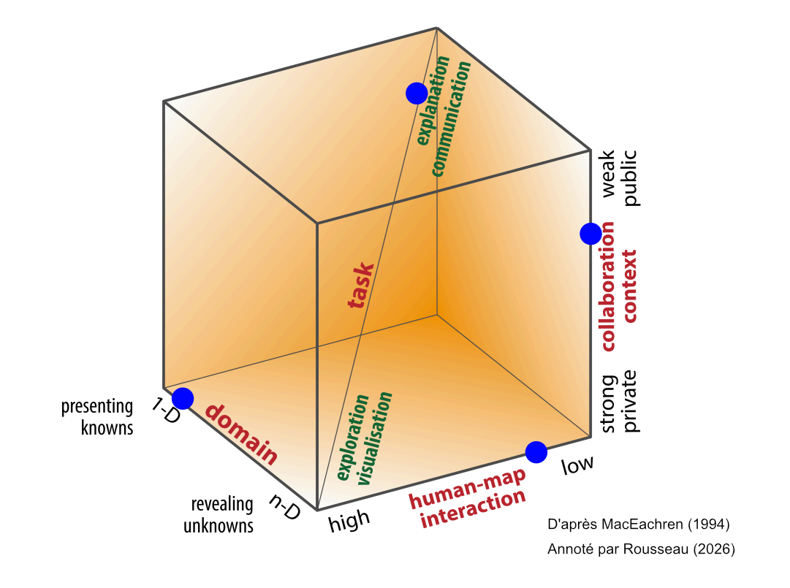
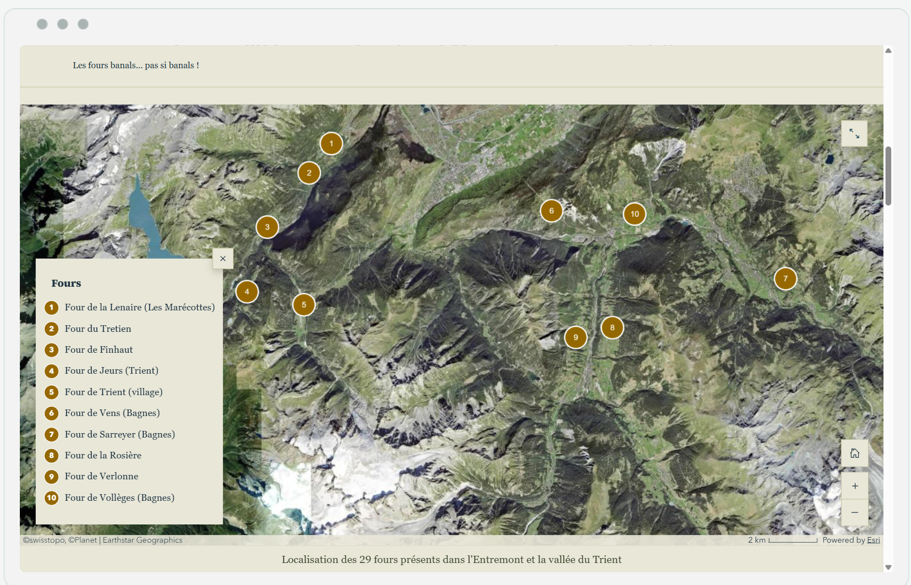
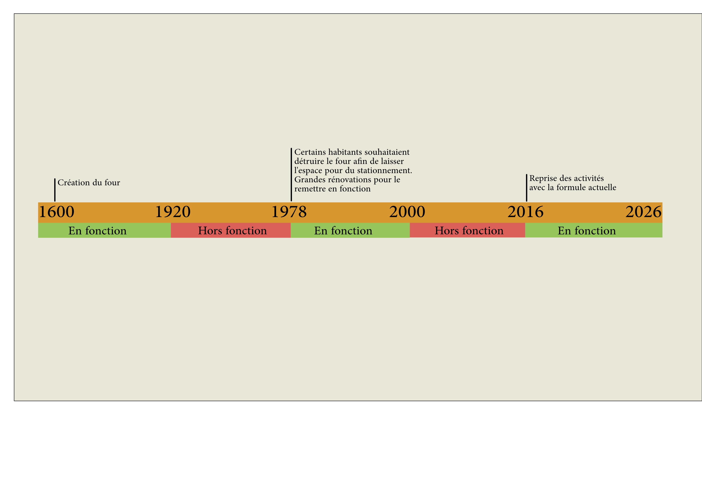
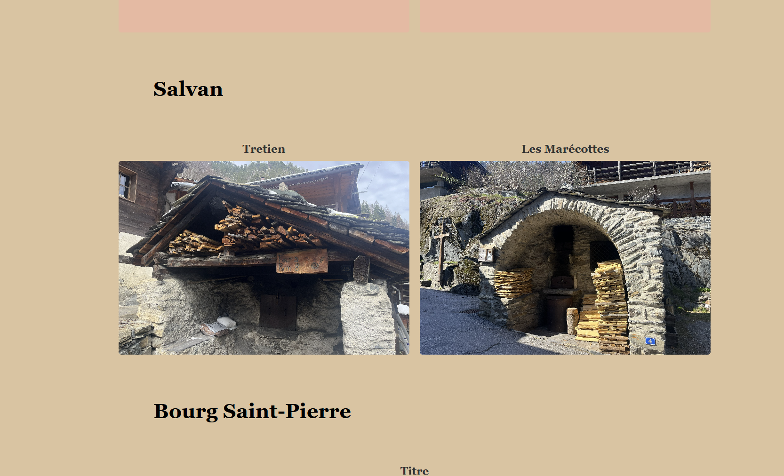
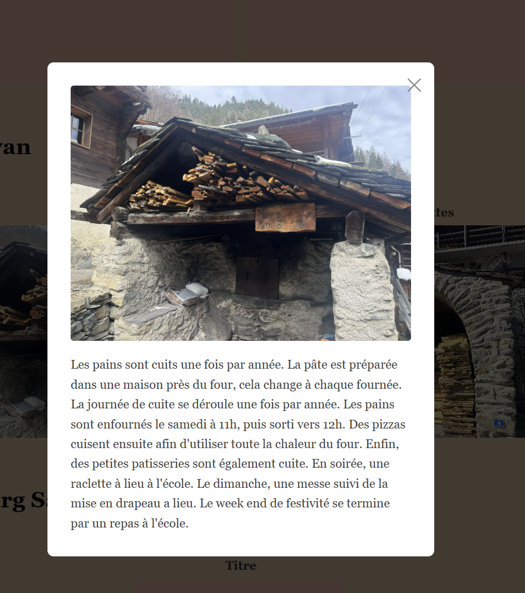
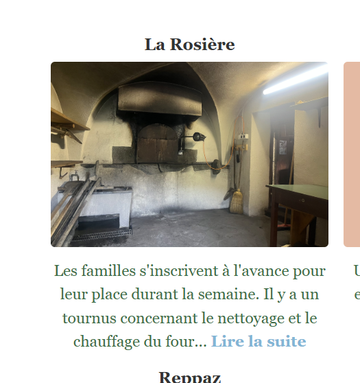
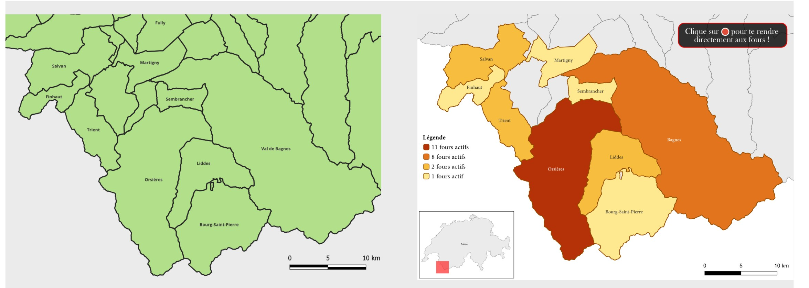

# **Géovisualisation de Alexia Rousseau, juin 2026**

## **Titre de ma géovisualisation**

### 1. Contexte du projet

Ce projet s'inscrit dans le cadre du cours Géovisualisation et traitement de l'information de Christian Kaiser (Université de Lausanne). L'objectif est de créer une visualisation, tout en intégrant les notions et concepts abordés durant les séances. Au fil de ce document de présentation, ces acquis théoriques permettront de nourrir la discussion et la justification des différents choix (représentation, interactivité, communication graphique, efficacité, facilité d'utilisation...)

Ce projet s'inscrit également dans le cours de Projet tutoré de Laine Chanteloup et Emmanuel Reynard. Mon équipe et moi avons été mandaté afin d'effectuer un inventaire et un projet de valorisation des fours banals dans la région de l'Entremont et de la vallée du Trient. Ainsi, la présente visualisation est créée en guise de support au projet de valorisation. 

#### 1.1 Objectifs de la visualisation

La visualisation a pour **premier objectif** de partager l'histoire des fours banals (FB). C'est d'abord une visée communicationnelle qui propulse ce projet. Cette histoire est par ailleurs partagé par le biais des informations recueillies lors des 29 entretiens effectuées avec les associations et consortages qui gèrent les fours banals de la région.

Un **second objectif** de ce projet est de créer du lien entre les fours banals. Il a été mentionné que l'histoire des fours, se trouvant parfois à seulement quelques kilomètres, étaient inconnnues. Ainsi, ce projet a pour objectif de communiquer des informations historiques sur les fours. 

##### 1.1.1 Questions 

Ainsi, la visualisation tente de répondre aux questions suivantes :
- Qu'est-ce qu'un four banal ?
- Quel est l'implication historique des fours banals dans l'Entremont et la vallée du Trient ?
- Quelles sont les principales tendances d'évolution des fours banals dans l'Entremont et la vallée du Trient ?
- Quelles sont les pratiques actuelles des fours banals dans l'Entremont et la vallée du Trient ?

#### 1.2 Importance de cette visualisation

#### 1.3 Définition du public cible

La définition du public cible est essentiel afin d'affiner la visualisation. De façon plus large, le public cible comprend des gens qui s'intéressent au four banal (membres d'associations, consortages), des gens qui veulent en apprendre sur les pratiques (nouvel·le habitant·e de la région), des historien·ne·s s'intéressant au patrimoine. 

Ce public cible n'est pas nécessairement à l'aise avec l'informatique. Ainsi, la visée communicationnelle, et non exploratoire, est mise de l'avant. 

Les tableaux suivants présentent les personas, en vu de la théorie et de l'exemple des personas abordés lors de la séance du 25.03.

**Personas 1 : Jean (65 ans), retraité, peu de connaissance en informatique** 
| **Caractéristiques** | **Objectifs** | **Attentes** |
|:-------|:-------|:-------|
|Résident du village des Marécottes depuis qu'il est né  | Connaître ce qui est fait au four à pain du village du Trétien  | Informations historiques sur les fours|
| Membre de l'association des amies du four à pain de la Lenaire  | Partager des informations avec ses proches non-connaisseurs des FB |Plateforme simple d'usage, lisible et ludique |

**Personas 2 : Louise (29 ans), professeure à Martigny, bonne connaissance en informatque**
|**Caractéristiques** |**Objectifs** |**Attentes** |
|:-------|:-------|:-------|
|Habite en Valais depuis 5 ans  | Connaître l'histoire des fours banals de la région | Informations historiques sur les fours|
|Intéressée par le patrimoine alimentaire valaisan  | Organiser une excursion avec ses élèves afin de visiter un four banal | Contenu vulgarisé et présence d'images |

**Personas 3 : Nelly (55 ans), historienne, bonne connaissance en informatique**
|**Caractéristiques**|**Objectifs**|**Attentes**|
|:-------|:-------|:-------|
|Habite en Valais depuis 10 ans | S'intéresse à la gouvernance des fours | Localisation précise des fours |
|Spécialiste du patrimoine valaisan  | Informations historiques afin de rédiger un article sur le patrimoine alimentaire | Présence d'image de qualité |

**Personas 4 : Julian (34 ans), travailleur saisonnier, bonne connaissance en informatique**
| **Caractéristiques** | **Objectifs** | **Attentes** |
|:-------|:-------|:-------|
|Habite en Valais depuis 1 ans |En apprendre sur les fours banals|Visualisation mémorable et compréhensible|
|Curieux de s'imprégner de la culture de son domicile  | Comprendre l'importance des fours dans l'histoire du village |Informations sur la participation |

### 2. Planification et réflexion sur la visualisation

Cette section comprend des réflexions fait au préalable et durant la création de la visualisation, concernant la sémiologie, l'interaction, la communication graphique...

#### 2.1 Réflexions théoriques 

Selon le cube de la géovisualisation (MacEachren, 1994), mon projet se situe vers les extrémités de chaque axes (figure 1). Les différents axes seront expliqués en détails:
- Task: Dans ce cas, la visualisation a une visée de communication, et non d'exploration. Le public cible n'est pas nécessairement à l'aise avec l'exploration, et le but est plutôt de communiquer une histoire. 
- Domain: La visualisation s'inscrit dans une présentation de données connus. Elle ne permet pas la révélation de données inconnues. Ainsi, elle se situe vers la gauche de l'axe Domain.
- Human-map interaction: L'interaction avec la visualisation est faible, mais pas absente. Le format Storymaps permet la présentation d'image cliquable et le déroulement de l'information vers le bas. Ainsi, il est possible de se déplacer à même la visualisation. En lien avec le public cible, cette faible interaction est pertinente, puisque le public n'est pas nécessairement connaisseur en informatique. En revanche, l'information et les images présentent seront possiblement téléchargeables pour le public intéressé.
- Collaboration context: Le public ciblé, comme décrit plus haut, comprend différents profils, tous non-experts. Ainsi, sur l'axe vertical, la visualisation se situe plutôt vers le haut.

**Figure 1 : Cube de la géovisualisaton**

*LLM : requête pour insérer image dans un format précis; requête pour centrer l'image*

La visualisation a pour but d'être un projet de communication, facile à lire et ludique. Le public se retrouvant sur la page, bien qu'intéressée, doit se faire attraper par la visualisation et souhaiter en apprendre davantage. Ainsi, l'esthétisme est important. De plus, afin d'attirer l'oeil, les couleurs sont importantes. Pour capter l'attention du lecteur, je souhaite également choisir minutieusement les informations à partager, en essayant d'avoir un minimum de diversité, tout en gardant une structure compréhensible. 

Dans ce sens, la lisibilité et l'accessibilité sont tout autant importante. Comme cette visualisation sera partagés et promut lors d'une exposition, il est important qu'elle soit facilement visualisable sur un téléphone. Durant le processus de création de la Storymaps, il y a la possibilité de la visualiser sur téléphone (portrait et paysage). La visualisaiton doit également être lisible et intéressante en format web. Enfin, les tâches que l'utilisateur doit accomplir (lecture, visualisation de photos) doivent être facile à accomplir. Il ne devrait pas y avoir besoin d'indications (ou peu).  

Le choix de la visualisation à l'aide d'une Storymaps est venu instinctivement dans l'optique où je souhaitais raconter une histoire et partager de l'informations. La forme souhaitée de type récit ou livret de communication se transpose bien sur la Storymaps. Cette fonctionnalité de ArcGIS permet de créer un récit numérique, en intégrant des cartes et images. D'autres fonctionnalités sont possibles, mais pour ce projet je me concentrerai sur ces deux options. En revanche, il est important de noter que les fonctionnalités de Storymaps sont restreintes. 

##### 2.2 Réflexions pratiques

Ainsi, les éléments historiques à intégrer dans la visualisation seraient :

| **À intégrer** | **Question** | **Objectif**|
|:-------|:-------|:-------|
|Définition d'un four banal |1| 1|
|Importance historique | 2 | 1|
|Carte avec localisation des fours| Élément de contexte| 1|

Puis, en fonction des fours choisis, intégrer des informations précises sur ceux-ci : 

| **À intégrer** | **Question** |  **Objectif**|
|:-------|:-------|:-------|
|Nom du four et emplacement |Éléments de contexte |2|
|Description des pratiques| 4 |2|
|Évolution du four| 4 |1 et 2|

#### 3. Réalisation de la visualisation

##### 3.1 Réflexions sur StoryMaps

Ma réflexion a évolué quant à l'intégration d'une carte de l'emplacement des fours. Au départ, j'ai cru bon d'insérer une carte avec l'emplacement de chacun des fours avec lesquels l'équipe s'est entretenue (voir figure 3). J'ai créé une carte dans Express Map (carte en ligne, créer à même la StoryMaps). Par contre, les options sont limités : 
- la légende n'apparait pas directement quand tu défiles sur la carte (elle est cachée dans le coin en bas et on doit cliquer), 
- il n'y a pas la possibilité de cliquer sur un four et ça mène directement au four plus bas

**Figure 3 : Carte créée dans Express Map (ArcGIS)**

Comme abordé ci-dessus, les premières idées d'éléments à intégrer ont été le texte et les images. Parmis les images, j'ai songé à créer des frises chronologiques pour suivre l'évolution d'un four à pain précis (figure 4). Cette ligne du temps comprends les périodes en fonciton et les périodes d'arrêt du four à pain, tout en intégrant les grands évènements tels que les rénovations. 

**Figure 4 : Exemple de frise chronologique**

En revanche, cette frise chronologique vient scinder l'enchainement naturel et intéressant de la Storymaps, en ajouter une lecture d'élément temporel horizontale dans le déroulement vertical. Ainsi, bien que j'avais déjà créé trois frises chronologiques, je ne sais toujours pas si je vais intégrer ces informations de cette façon.

##### 3.2 Réfexions sur la planification du projet

J'avais commencé ma StoryMaps (prototype) en prenant des bribes de fichiers à gauche et à droite. Par contre, en créant ce document synthèse, j'ai rapidement réalisé qu'il serait préférable d'avoir un fichier de texte avec tous les éléments que je souhaite intégrer. Ainsi, le fichier [infos](infos) comprends les éléments de texte à intégrer dans ma visualisation, en fonction des tableaux définis en section 2.2.

J'ai essayé de penser à une autre façon de partager l'information. Afin de tester autre chose, j'ai demandé à Claude.IA de créer un code avec la requête : "Je veux un code en html qui donne une page comme l'image (images/claude/demande_essai_html). Le but est d'avoir un titre, suivi de deux zones de texte, suivi d'un espace pour insérer des images (3 images une a côté de l'autre). Je veux pouvoir cliquer sur l'image, et qu'il y aille un pop-up qui apparaisse (et je puisse écrire une info)". Ensuite, d'autres requêtes ont suivi afin de peaufiner cette idée (Je veux ajouter au dessus de chacune des images un titre, centré sur l'image). J'ai ensuite ajouté et modifié ces codes. Le résultat de ce test est le document [ici](foursbanalsT1.html).

Dans la suite de ce document et afin de mieux comprendre ce dont il est question (géographiquement), j'ai songé à ajouté une carte au départ, avec des éléments cliquables qui mène à la commune précise. Ainsi, la requête : "Est-il possible, au début, d'insérer une carte avec des points cliquables ? et ces points pourraient référer aux différentes sections plus bas dans le document?" a été demandé à ClaudeIA. Sa réponse a suggéré l'intégration d'une carte statique, avec l'ajout de point. Ainsi, la question est désormais de trouver une carte assez précise pour situé l'utilisateur, tout en ne le surchargeant pas d'informations.

Afin de classer les fours par communues, j'ai demandé à Claude.IA un code : Je veux un code qui ressemble au code pour les images cliquables (ci-dessus). J'ai besoin de : un code qui inclut 12 images (4 lignes de 3 images), un code de 9 images (3 lignes de 3 images),un code de 4 images (2 lignes de 2 images - centré) et un code de 1 image (centré). Le code ne donnait pas les images que je souhaitais, j'ai redemandé un code avec 4 lignes, 3 images par lignes. En ajoutant les images, j'ai réalisé que pour la commune d'Orsières, il y avait 11 fours (et non 12). J'ai demandé à Claude : "dans la section ORSIÈRES, je veux enlever le titre 12 (il n'y en a pas). Les deux autres images de cette ligne doivent être centrer." La même manipulation a été demandé pour Bagnes (8 fours au lieu de 9). De plus, j'ai demandé à Claude : "Est-ce possible dans le style de faire que les images sont toutes du même format ? Format 3:2." Et il a ajouté une règle CSS. De plus, les règles CSS étaient différentes pour différentes sections (ajout de différents codes et styles de façon ecclectiques au cours de la création de cette sections). J'ai demandé à Claude d'uniformiser les styles.

Après réflexion sur la forme décrite ci-dessus, je trouvais que de seulement voir l'image et de devoir effectuer un clic (sans savoir qu'il était possible) n'était pas vraiment dans une visée d'accompagnation de l'utilisateur (figure 5). Ainsi, j'ai songé à ajouter le début de mon texte directement sous l'image, qui se terminerait par ... *Lire la suite*, d'une différente couleur (bleu pâle) insitant ainsi à cliquer. De plus, afin d'intégrer des informations (en guise de réponse aux questions), je vais intégrer une section Évolution, visible lors du clic, qui comprend la frise chronologique. Actuellement, lors du clic, seul un texte apparait et il serait bon de mieux structurer cette partie afin qu'elle soit plus compréhensible (figure 6).

**Figure 5 : Mise en forme imprécise**

**Figure 6 : Manque de clarté dans le pop-up**

Afin de mettre en oeuvre ces changements, j'ai demandé à ClaudeIA "je veux mettre le début (2 lignes) de chacun des textes directement sous l'image (texte actuellement seulement visible au pop-up), sur la page principale. Je veux que ce texte se termine par "lire la suite...", pour inciter le public à cliquer. Tu peux faire un test avec le premier élément (La Rosière)" Le résultat était satisfaisant (figure 7), mais j'ai fait une seconde requête afin de raccourcir le texte visible (140 à 120 caratctères, puis 50 caractères).

**Figure 7 : Intégration Lire la suite**

Afin de modifier le pop up, j'ai effectué la requête : "Je veux divisé le pop up en plusieurs sections. Je veux avoir les sous-titres : Pratiques actuelles et Évolution. Le texte actuel se trouverait sous le sous-titre Pratiques actuelles. Sous le sous-titre Évolution, il y aurait place à insérer une image. Tu peux faire un test avec le four de la Rosière." Le résultat était satisfaisant, mais lors de l'ouverture du pop-up, la mise en page ne permettait pas de lire toute l'information, ni de défiler... J'ai essayé de mettre les images une à côté de l'autre, mais je n'aime pas mieux (lisibilité de la fris chronologique fiable). J'ai réalisé que le problème était le format de la frise. L'image n'était pas du tout cadré correctement. Je crois qu'en la cadrant correctement, elle sera lisible dans le format vertical du pop-up. J'ai ensuite demandé à ClaudeIA d'implémenter le même format pour tous les autres fours. Enfin, je trouvais que la frise n'était toujours pas très visible, j'ai demandé à ClaudeIA qu'elle soit clicable (pour la voir en plus grand). Et le background était noir, donc on voyait mal (car c'est un fichier sans fond - texte noir sur noir était problématique) et j'ai modifié le fond en blanc. Ensuite, j'ai rajouté une fonction que tous les pop ups sont du même format, et un scroll, afin d'uniformiser (avec une requête à ClaudeIA).

J'ai fait la requête à ClaudeIA "Voici un site web que j'ai créée. Pouvez vous me faire des commentaires (contenu et format) ?". Ses réponses contenaient des améliorations quant au entretiens (non mis en valeur), à la partie introductive (longue) et au format (pas de bouton retour en haut, historique trop long, pas de coupure avec la carte). Ainsi, ClaudeIA a créé
1. Code (html et css) pour les différentes sections de la partie historique
1. Code (html, css et js) pour le bouton retour en haut
1. Code (html, css) pour insérer une bannière qui structure la page. 

J'ai ensuite demandé comment la carte pouvait être améliorer (comment est ce que je pourrais améliorer cette carte pour qu'elle soit plus compréhensible ?). Ses réponses contenaient des point d'améliorations concernant la légende (absente), le contexte géographique (absent), la symbologie (incompréhensible). J'ai ensuite retravaillé la carte sur QGIS et Affinity afin de produire une carte plus structurée.

**Figure 8 : Évolution de la carte**

#### 4. Visualisation réalisée

##### 4.1 Description de la visualisation réalisée

La visualisation a d'abord été conceptualisé et réalisé sous la forme d'une StoryMaps, une fonctionnalité de ArcGIS.  
Ensuite, comme défini plus haut, le projet a été transféré en html. 

#### 4.2 Évaluation de la visualisation

*Évaluer l'efficience de l'interface*
*Faciliter la tâche de l'utilisateur: faire des interfaces simples, mettre en évidence ce qui est important (prendre l'utilisateur à la main)*

##### 4.2.1 Points forts

##### 4.2.1 Points faibles

#### 4.3 Résultats des testes utilisateurs

### 5. Discussion et conclusion

### Bibliographique

MacEachren, A. M. (1994). Visualization in Modern Cartography: Setting the Agenda. In Modern Cartography Series (Ced., pp. 1-12). (Modern Cartography Series; Vol. 2, No. C). DOI:10.1016/B978-0-08-042415-6.50008-9 

https://lopanner.com/main/ 

### Déclaration d'intelligence artificielle

Les différentes requêtes à ClaudeIA ont été insérées tout au long du document. 
Je certifie que ce sont les seules demandes qui ont été effectuées dans le cadre de ce projet. 
Le reste des idées, textes et design sont le fruit de mon travail.

Enfin, afin de publier ce document, j'ai effectué la requête à Claude.IA "Comment déposer un .md sur un serveur html avec github?"

